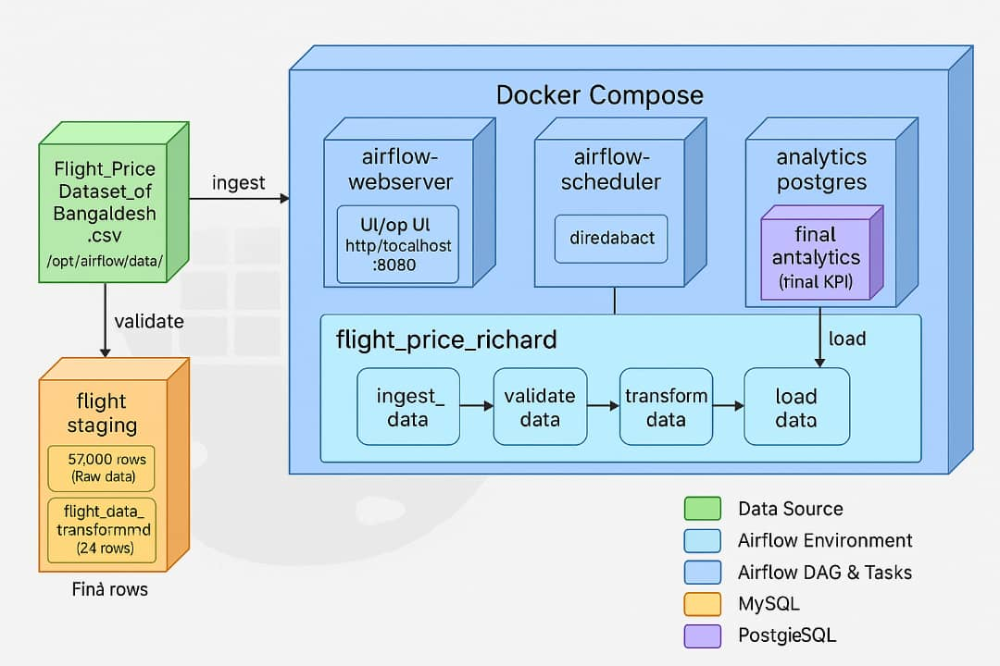

#  Flight Price Pipeline Project 




This report provides a detailed overview of the flight price data pipeline project, implemented using Apache Airflow and Docker. The pipeline processes flight price data for Bangladesh, calculating key performance indicators (KPIs) for analysis.

## Pipeline Architecture and Execution Flow.

### Architecture Overview
The pipeline is designed as a modular, containerized workflow using Apache Airflow (`apache/airflow:2.8.1`) to orchestrate the data processing steps. Key components include:

- **Data Source**: The input dataset, `Flight_Price_Dataset_of_Bangladesh.csv`, contains 57,000 rows of flight price data. It is mounted into the container at `/opt/airflow/data/` via Docker volumes.
- **Databases**:
  - **MySQL** (`flight_staging` database): Used as a staging database to store raw data (`flight_data_staging` table) and transformed data (`flight_data_transformed` table).
  - **PostgreSQL** (`flight_analytics` database): Used as an analytics database to store the final KPI results (`avg_fare_by_airline` table).
- **Airflow Setup**:
  - **DAG**: A single DAG named `flight_price_richard` orchestrates the workflow.
  - **Tasks**: Four tasks (`ingest_data`, `validate_data`, `transform_data`, `load_data`) handle the data processing stages.
- **Execution Environment**:
  - Docker containers are defined in `docker-compose.yml`, including `airflow-webserver`, `airflow-scheduler`, `mysql`, and `analytics-postgres`.
  - Logs are stored in `/opt/airflow/logs/` inside the container and captured locally using `docker-compose logs`.

### Execution Flow
The pipeline follows a linear execution flow, with each task depending on the successful completion of the previous one:

1. **Ingestion (`ingest_data`)**:
   - Reads the CSV file using `pandas`.
   - Validates the presence of required columns (e.g., `Airline`, `Total Fare (BDT)`).
   - Loads the data into the `flight_data_staging` table in MySQL.
   - **Output**: 57,000 rows in `flight_data_staging`.

2. **Validation (`validate_data`)**:
   - Reads data from `flight_data_staging`.
   - Performs quality checks:
     - Ensures no missing values in `Total Fare (BDT)`.
     - Verifies `Duration (hrs)` is between 0 and 24.
     - Confirms `Departure Date & Time` is in a valid datetime format.
   - Fails if issues are found; otherwise, proceeds to the next task.

3. **Transformation (`transform_data`)**:
   - Reads data from `flight_data_staging`.
   - Calculates the average fare by airline (KPI).
   - Saves the result (24 rows, one per airline) to the `flight_data_transformed` table in MySQL.

4. **Loading (`load_data`)**:
   - Reads transformed data from `flight_data_transformed`.
   - Loads it into the `avg_fare_by_airline` table in PostgreSQL for analytics purposes.
   - **Output**: 24 rows in `avg_fare_by_airline`.

## Description of Each Airflow DAG/Task

### DAG: `flight_price_richard`
- **Purpose**: Orchestrates the end-to-end pipeline for processing flight price data.
- **Schedule**: Runs daily at midnight (`schedule_interval='@daily'`).
- **Start Date**: May 18, 2025.
- **Customization**: Renamed to `flight_price_richard` to reflect my unique contribution, making it distinct in the Airflow UI.

### Tasks
1. **`ingest_data`**:
   - **File**: `data_ingestion.py`
   - **Purpose**: Loads raw CSV data into the MySQL staging table.
   - **Input**: `Flight_Price_Dataset_of_Bangladesh.csv` (57,000 rows).
   - **Output**: `flight_data_staging` table in MySQL.
   - **Details**: Validates required columns (e.g., `Airline`, `Total Fare (BDT)`) and logs the process.

2. **`validate_data`**:
   - **File**: `data_validation.py`
   - **Purpose**: Ensures data quality before further processing.
   - **Input**: `flight_data_staging` table.
   - **Checks**:
     - No missing values in `Total Fare (BDT)`.
     - `Duration (hrs)` between 0 and 24.
     - Valid `Departure Date & Time` format.
   - **Output**: Passes if no issues; fails with an error if validation fails.

3. **`transform_data`**:
   - **File**: `data_transformation.py`
   - **Purpose**: Computes the KPI (average fare by airline).
   - **Input**: `flight_data_staging` table.
   - **Output**: `flight_data_transformed` table (24 rows).
   - **Details**: Groups data by `Airline` and calculates the mean `Total Fare (BDT)`.

4. **`load_data`**:
   - **File**: `data_loading.py`
   - **Purpose**: Transfers transformed data to PostgreSQL for analytics.
   - **Input**: `flight_data_transformed` table.
   - **Output**: `avg_fare_by_airline` table in PostgreSQL.

## KPI Definitions and Computation Logic

### KPI: Average Fare by Airline
- **Definition**: The mean `Total Fare (BDT)` for each airline, representing the typical cost of flights operated by that airline.
- **Purpose**: Provides insights into pricing differences across airlines, useful for competitive analysis and decision-making.
- **Computation Logic**:
  - **Location**: Implemented in `data_transformation.py`.
  - **Code**:
    ```python
    avg_fare_by_airline = df.groupby("Airline")["Total Fare (BDT)"].mean().reset_index()
    avg_fare_by_airline.columns = ["Airline", "Average_Fare_BDT"]


## KPI Computation Logic: Average Fare by Airline

### Steps:
- Load the raw data from `flight_data_staging` into a pandas DataFrame.
- Group the data by `Airline`.
- Compute the mean of `Total Fare (BDT)` for each airline.
- Reset the index to convert the grouped data into a DataFrame with `Airline` as a column.
- Rename the columns to `Airline` and `Average_Fare_BDT` for clarity.
- **Output**: A table with 24 rows (one per airline), saved to `flight_data_transformed` (MySQL) and `avg_fare_by_airline` (PostgreSQL).

## Challenges Encountered and How They Were Resolved

### Challenge: Initial Container Setup Issues
- **Issue**: Containers failed to start due to misconfiguration in `docker-compose.yml`.
- **Resolution**: Updated `docker-compose.yml` to use `apache/airflow:2.8.1`, fixed port mappings (e.g., `0.0.0.0:8080->8080/tcp`), and ensured proper volume mounts (e.g., `./data:/opt/airflow/data`).

### Challenge: Environment Variable Errors in `data_ingestion.py`
- **Issue**: `ValueError: invalid literal for int() with base 10: 'None'` due to missing `MYSQL_PORT` in `.env`.
- **Resolution**: Added default values (e.g., `mysql_port = os.getenv("MYSQL_PORT", "3306")`) and logged connection details for debugging.

### Challenge: `ModuleNotFoundError` in DAG
- **Issue**: `ModuleNotFoundError: No module named 'scripts.data_ingestion'` when running the DAG.
- **Resolution**: Added `sys.path.append('/opt/airflow/scripts')` to `flight_price_richard.py` to include the `scripts/` directory in the Python path.

### Challenge: Empty Local Logs
- **Issue**: Local `logs/` folder files were empty despite successful runs.
- **Resolution**: Used `docker-compose logs` to capture container logs (e.g., `docker-compose logs airflow-webserver > logs/airflow-webserver.log`) and included them in the repository.

## Conclusion
The pipeline successfully processes 57,000 rows of flight price data, validates data quality, calculates the average fare by airline, and stores the results in PostgreSQL for analytics. The project demonstrates a robust use of Airflow, Docker, and database integration. 

Author - Richard Nii DJanie Amasah